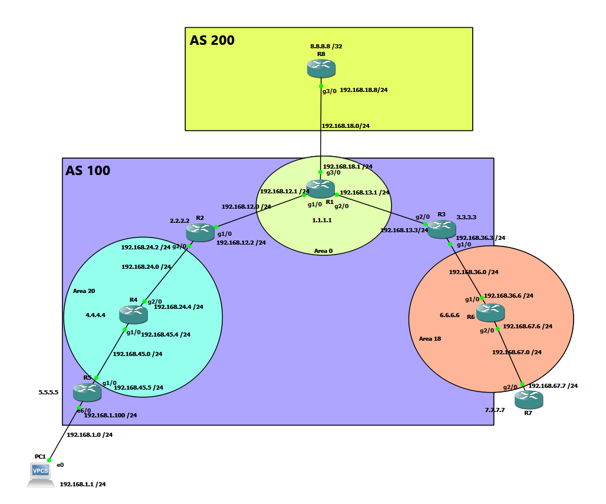

# ISP-Style Multi-Router Network — OSPF & BGP

## Project Overview

This project simulates an ISP-style multi-router network using Cisco IOS in GNS3. The lab demonstrates internal and external routing, route propagation, end-to-end connectivity, and systematic network troubleshooting.

## Technologies Used

- Cisco IOS
- GNS3
- OSPF
- BGP
- Static Routing
- IPv4 Addressing
- DHCP
- NAT/PAT
- Cisco CLI
- Network Troubleshooting

## Network Objectives

- Build a multi-router ISP-style topology.
- Configure IPv4 addressing across router interfaces.
- Establish internal routing using OSPF.
- Configure BGP between different autonomous systems.
- Advertise and verify network prefixes.
- Provide LAN clients with network connectivity.
- Validate end-to-end communication.
- Troubleshoot routing and connectivity failures.

## Network Topology

The topology represents a multi-area OSPF network inside **AS 100**, with an external BGP connection to **AS 200**.



### Topology Highlights

- **AS 100** represents the internal enterprise/service-provider routing domain.
- **AS 200** represents an external network reachable through BGP.
- **R1** acts as the primary edge/core router connecting AS 100 to AS 200.
- **OSPF Area 0** provides the backbone routing area.
- Additional OSPF areas demonstrate multi-area routing.
- Router loopback interfaces are used to represent stable network prefixes.
- **PC1** represents an end-user LAN host used for end-to-end connectivity testing.
- The `8.8.8.8/32` loopback on R8 represents an external destination used for reachability testing.

## IP Addressing Plan

| Device | Interface / Loopback | IP Address | Network | Purpose |
|---|---|---|---|---|
| R1 | Loopback0 | 1.1.1.1/32 | 1.1.1.1/32 | Router ID / Internal Prefix |
| R1 | G1/0 | 192.168.12.1/24 | 192.168.12.0/24 | Link to R2 |
| R1 | G2/0 | 192.168.13.1/24 | 192.168.13.0/24 | Link to R3 |
| R1 | G3/0 | 192.168.18.1/24 | 192.168.18.0/24 | External link to R8 |
| R2 | Loopback0 | 2.2.2.2/32 | 2.2.2.2/32 | Router ID |
| R2 | G1/0 | 192.168.12.2/24 | 192.168.12.0/24 | Link to R1 |
| R2 | G2/0 | 192.168.24.2/24 | 192.168.24.0/24 | Link to R4 |
| R3 | Loopback0 | 3.3.3.3/32 | 3.3.3.3/32 | Router ID |
| R3 | G2/0 | 192.168.13.3/24 | 192.168.13.0/24 | Link to R1 |
| R3 | G1/0 | 192.168.36.3/24 | 192.168.36.0/24 | Link to R6 |
| R4 | Loopback0 | 4.4.4.4/32 | 4.4.4.4/32 | Router ID |
| R4 | G2/0 | 192.168.24.4/24 | 192.168.24.0/24 | Link to R2 |
| R4 | G1/0 | 192.168.45.4/24 | 192.168.45.0/24 | Link to R5 |
| R5 | Loopback0 | 5.5.5.5/32 | 5.5.5.5/32 | Router ID |
| R5 | G1/0 | 192.168.45.5/24 | 192.168.45.0/24 | Link to R4 |
| R5 | E6/0 | 192.168.1.100/24 | 192.168.1.0/24 | LAN gateway |
| R6 | Loopback0 | 6.6.6.6/32 | 6.6.6.6/32 | Router ID |
| R6 | G1/0 | 192.168.36.6/24 | 192.168.36.0/24 | Link to R3 |
| R6 | G2/0 | 192.168.67.6/24 | 192.168.67.0/24 | Link to R7 |
| R7 | Loopback0 | 7.7.7.7/32 | 7.7.7.7/32 | Router ID |
| R7 | G2/0 | 192.168.67.7/24 | 192.168.67.0/24 | Link to R6 |
| R8 | Loopback0 | 8.8.8.8/32 | 8.8.8.8/32 | External Test Prefix |
| R8 | G3/0 | 192.168.18.8/24 | 192.168.18.0/24 | BGP link to R1 |
| PC1 | E0 | 192.168.1.1/24 | 192.168.1.0/24 | End-user host |

### Routing Domains

- **AS 100:** R1–R7
- **AS 200:** R8
- **OSPF Area 0:** Core/backbone around R1
- **OSPF Area 20:** R2–R4–R5 side
- **OSPF Area 18:** R3–R6–R7 side
- **eBGP Peering:** R1 (AS 100) ↔ R8 (AS 200)

## Configuration

Router configurations will be documented in the `configs` directory.

Topics include:

- Interface configuration
- IPv4 addressing
- Static and default routes
- OSPF configuration
- BGP neighbor relationships
- Network advertisement
- DHCP
- NAT/PAT

## Verification

Network operation is verified using commands such as:

```text
show ip interface brief
show ip route
show ip ospf neighbor
show ip ospf database
show ip bgp
show ip bgp summary
ping
traceroute
```

## Troubleshooting

The lab includes troubleshooting scenarios involving:

- Missing routes
- Incorrect next-hop configuration
- OSPF adjacency problems
- BGP neighbor and prefix advertisement issues
- Return-path routing failures
- NAT configuration issues
- End-to-end connectivity failures

## Key Skills Demonstrated

- Cisco Routing & Switching
- OSPF
- BGP Fundamentals
- IPv4 Addressing
- Routing Table Analysis
- Network Troubleshooting
- Fault Isolation
- Cisco IOS CLI
- GNS3 Network Simulation

## End-to-End Validation

The completed lab successfully provides connectivity from the internal client LAN through a multi-area OSPF network to an external BGP destination.

### Verified Traffic Path

```text
PC1 (192.168.1.1)
        |
        | Default Gateway
        v
R5 (192.168.1.100)
        |
        | OSPF Area 20
        v
R4
        |
        v
R2 (ABR)
        |
        | OSPF Area 0
        v
R1 (AS 100)
        |
        | eBGP
        v
R8 (AS 200)
        |
        v
8.8.8.8/32

## Project Status

🚧 Documentation and configurations are being added.
