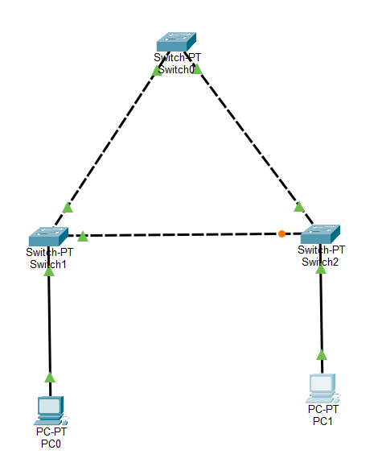

# Enterprise Switching, VLANs & RSTP Lab

## Overview

This lab demonstrates a redundant Layer 2 enterprise switching topology using Cisco switches in Packet Tracer.

The network implements VLAN segmentation, IEEE 802.1Q trunking, Rapid Spanning Tree Protocol (Rapid-PVST+), deterministic root bridge selection, PortFast, BPDU Guard, and redundant-path failover.

The lab also includes troubleshooting of an STP/BPDU Guard issue that placed a switch port into the err-disabled state.

## Network Topology



The topology uses three Layer 2 switches in a redundant triangular design. SW1 is configured as the primary root bridge and SW2 as the secondary root bridge for VLAN 10. RSTP prevents Layer 2 loops while maintaining a redundant path through SW2 if the direct SW3-to-SW1 link fails.

## Technologies

- Cisco Layer 2 Switching
- VLANs
- IEEE 802.1Q Trunking
- Rapid-PVST+
- Spanning Tree Protocol (STP/RSTP)
- Root Bridge Election
- PortFast
- BPDU Guard
- Layer 2 Redundancy
- Cisco Packet Tracer

## Topology

Three switches form a redundant triangular Layer 2 topology.

- SW1 — Primary Root Bridge
- SW2 — Secondary Root Bridge
- SW3 — Access/Distribution Switch
- PC0 — 192.168.10.10/24
- PC1 — 192.168.10.20/24
- User devices are assigned to VLAN 10 (USERS)

## VLAN Design

| VLAN | Name | Purpose |
|---|---|---|
| 1 | default | Native/default VLAN |
| 10 | USERS | End-user network |

## Spanning Tree Design

Rapid-PVST+ is enabled across the switching topology.

For VLAN 10:

- SW1 is configured as the primary root bridge.
- SW2 is configured as the secondary root bridge.
- SW3 uses its direct link toward SW1 as the root port.
- The redundant SW3-to-SW2 path is placed into the Alternate/Blocking state during normal operation.

Normal SW3 state:

```text
Fa1/1  Root  FWD
Fa0/1  Altn  BLK
Fa2/1  Desg  FWD
