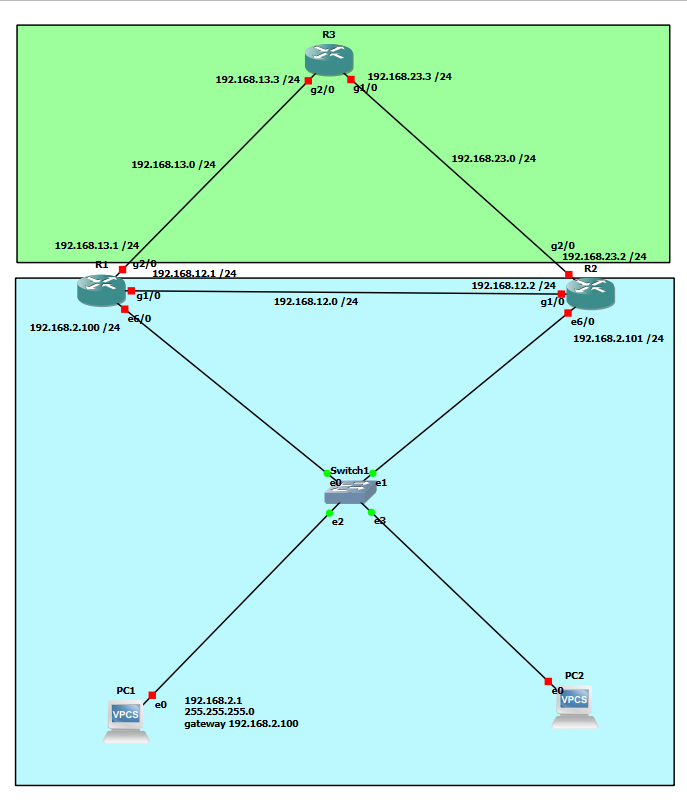

# HSRP First-Hop Redundancy with EIGRP

## Overview

This lab demonstrates first-hop gateway redundancy using Cisco Hot Standby Router Protocol (HSRP) combined with EIGRP dynamic routing.

Two routers provide a shared virtual default gateway for the LAN. R1 operates as the preferred Active router because of its higher HSRP priority, while R2 operates as the Standby router.

A failure of R1's LAN-facing interface was simulated to verify automatic gateway failover. R2 successfully transitioned from Standby to Active while end-to-end connectivity remained available.

After R1 was restored, HSRP preemption allowed R1 to reclaim the Active role.

## Technologies

- Cisco IOS
- HSRP
- EIGRP
- First-Hop Redundancy
- Dynamic Routing
- Virtual Default Gateway
- Gateway Failover
- Preemption
- ICMP Connectivity Testing
- GNS3

## Network Topology

The topology provides redundant first-hop gateway connectivity for the `192.168.2.0/24` LAN.

- **R1** — Preferred HSRP Active router, priority 150
- **R2** — HSRP Standby router, default priority 100
- **Virtual Gateway** — `192.168.2.250`
- **R3** — Remote router with `8.8.8.8/32` loopback for connectivity testing
- **EIGRP AS 90** — Provides dynamic routing between R1, R2, and R3
