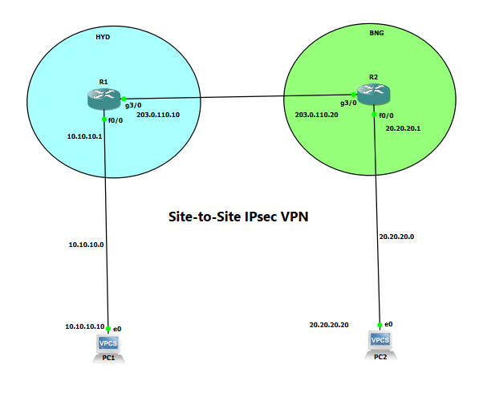

# Site-to-Site IPsec VPN

## Overview

This lab implements a policy-based Site-to-Site IPsec VPN between two remote networks using Cisco IOS routers.

The HYD site protects the `10.10.10.0/24` LAN, while the BNG site protects the `20.20.20.0/24` LAN.

IKE Phase 1 establishes the secure peer relationship, while IPsec Phase 2 protects traffic between the two private networks.

End-to-end testing confirmed successful encrypted communication between PC1 and PC2.

## Technologies

- Cisco IOS
- Site-to-Site IPsec VPN
- IKE / ISAKMP
- Pre-Shared Key Authentication
- IPsec ESP
- Crypto Maps
- Extended ACLs
- Static Routing
- Tunnel Mode
- VPN Security Association Verification
- GNS3

## Network Topology



The topology represents two remote sites connected across a WAN and protected using a policy-based Site-to-Site IPsec VPN.

- **HYD LAN:** `10.10.10.0/24`
- **HYD VPN Endpoint:** `203.0.110.10`
- **BNG LAN:** `20.20.20.0/24`
- **BNG VPN Endpoint:** `203.0.110.20`
- **Protected Traffic:** `10.10.10.0/24 ↔ 20.20.20.0/24`
- **VPN Mode:** IPsec Tunnel Mode

## IP Addressing

| Device | Interface | IP Address | Purpose |
|---|---|---|---|
| HYD | Fa0/0 | 10.10.10.1/24 | HYD LAN gateway |
| HYD | Gi3/0 | 203.0.110.10/24 | VPN/WAN interface |
| BNG | Fa0/0 | 20.20.20.1/24 | BNG LAN gateway |
| BNG | Gi3/0 | 203.0.110.20/24 | VPN/WAN interface |
| PC1 | Ethernet | 10.10.10.10/24 | HYD host |
| PC2 | Ethernet | 20.20.20.20/24 | BNG host |

## IKE Phase 1

Both VPN peers use the following ISAKMP policy:

```text
Encryption:       3DES
Hash:             MD5
Authentication:   Pre-Shared Key
Diffie-Hellman:   Group 2
```

The pre-shared key is intentionally redacted from the GitHub documentation.

Example structure:

```text
crypto isakmp policy 1
 encr 3des
 hash md5
 authentication pre-share
 group 2
```

## IPsec Phase 2

The IPsec transform set is:

```text
crypto ipsec transform-set TS esp-3des esp-md5-hmac
 mode tunnel
```

The VPN therefore uses:

```text
ESP Encryption: 3DES
ESP Integrity:  MD5-HMAC
Mode:           Tunnel
```

## Interesting Traffic

HYD defines traffic from:

```text
10.10.10.0/24 → 20.20.20.0/24
```

BNG defines the reverse traffic:

```text
20.20.20.0/24 → 10.10.10.0/24
```

This traffic is matched by the `VPN-TRAFFIC` extended ACL and protected by IPsec.

## Crypto Map

The crypto map:

- Identifies the remote VPN peer
- References the IPsec transform set
- Matches the VPN traffic ACL
- Is applied to the WAN-facing interface

Crypto map name:

```text
CMAP
```

WAN interface:

```text
GigabitEthernet3/0
```

## Routing

HYD uses a static route to reach the BNG LAN:

```text
ip route 20.20.20.0 255.255.255.0 203.0.110.20
```

BNG uses a static route to reach the HYD LAN:

```text
ip route 10.10.10.0 255.255.255.0 203.0.110.10
```

## IKE Verification

After generating interesting traffic, HYD reported:

```text
HYD#show crypto isakmp sa

dst             src             state          conn-id status
203.0.110.20    203.0.110.10    QM_IDLE           1001 ACTIVE
```

The `QM_IDLE` state confirms that the IKE security association was successfully established.

## IPsec Verification

HYD reported:

```text
local ident:
10.10.10.0/255.255.255.0

remote ident:
20.20.20.0/255.255.255.0

current_peer:
203.0.110.20

#pkts encaps: 4
#pkts encrypt: 4

#pkts decaps: 4
#pkts decrypt: 4

#send errors: 0
#recv errors: 0
```

Both inbound and outbound ESP security associations reported:

```text
Status: ACTIVE(ACTIVE)
```

BNG independently reported the corresponding reverse security associations and matching encryption/decryption counters.

## End-to-End Validation

PC1 initiated traffic toward PC2:

```text
PC1> ping 20.20.20.20

20.20.20.20 icmp_seq=1 timeout
84 bytes from 20.20.20.20 icmp_seq=2 ttl=62 time=106.545 ms
84 bytes from 20.20.20.20 icmp_seq=3 ttl=62 time=60.778 ms
84 bytes from 20.20.20.20 icmp_seq=4 ttl=62 time=60.143 ms
84 bytes from 20.20.20.20 icmp_seq=5 ttl=62 time=60.234 ms
```

The initial packet timed out while the VPN security associations were being established. Subsequent traffic successfully crossed the VPN.

The IPsec counters increased to four encrypted and four decrypted packets, confirming that the successful ICMP traffic was protected by IPsec.

## VPN Traffic Flow

```text
PC1
10.10.10.10
     |
     v
HYD
10.10.10.1
     |
     | Interesting traffic detected
     v
IKE / IPsec Negotiation
     |
     v
ESP Encrypted Traffic
203.0.110.10 ==================> 203.0.110.20
                                      |
                                      v
                                     BNG
                                      |
                                      v
                                     PC2
                                20.20.20.20
```

## Skills Demonstrated

- Site-to-Site IPsec VPN configuration
- IKE/ISAKMP Phase 1 configuration
- IPsec Phase 2 configuration
- Pre-shared key authentication
- Extended ACL configuration
- Interesting traffic identification
- Crypto map configuration
- ESP tunnel-mode operation
- Static routing between remote sites
- IKE security association verification
- IPsec security association verification
- Encryption/decryption counter analysis
- End-to-end VPN connectivity testing
