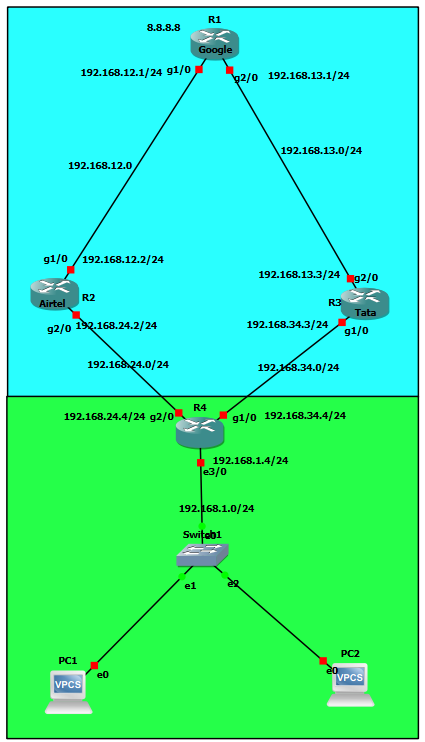

# Dual-Path WAN Failover Using IP SLA, Object Tracking, and Floating Static Routes

## Project Overview

This lab demonstrates a dual-path WAN design with automatic failover and failback using Cisco IP SLA, object tracking, floating static routes, and DHCP.

The network uses Airtel as the preferred primary path and Tata as the backup path. IP SLA monitors reachability across the primary path. If the primary path becomes unavailable, tracked static routes are removed and floating static routes automatically redirect traffic through Tata.

The lab also implements return-path tracking on the Google router so that both forward and return traffic can fail over correctly.

## Network Topology



### Primary Path

```text
PC1 → R4 → Airtel → Google → 8.8.8.8
```

### Backup Path

```text
PC1 → R4 → Tata → Google → 8.8.8.8
```

## IP Addressing

| Device | Interface | IP Address | Purpose |
|---|---|---|---|
| R4 | Ethernet3/0 | 192.168.1.4/24 | LAN / Default Gateway |
| R4 | GigabitEthernet2/0 | 192.168.24.4/24 | Primary Airtel Link |
| R4 | GigabitEthernet1/0 | 192.168.34.4/24 | Backup Tata Link |
| Airtel | GigabitEthernet2/0 | 192.168.24.2/24 | Link to R4 |
| Airtel | GigabitEthernet1/0 | 192.168.12.2/24 | Link to Google |
| Tata | GigabitEthernet1/0 | 192.168.34.3/24 | Link to R4 |
| Tata | GigabitEthernet2/0 | 192.168.13.3/24 | Link to Google |
| Google | GigabitEthernet1/0 | 192.168.12.1/24 | Airtel Path |
| Google | GigabitEthernet2/0 | 192.168.13.1/24 | Tata Path |
| Google | Loopback0 | 8.8.8.8/32 | Test Destination |

## Technologies Implemented

- Cisco IOS static routing
- DHCP
- IP SLA ICMP Echo
- Object Tracking
- Floating Static Routes
- Administrative Distance
- Primary/Backup WAN Routing
- Bidirectional Failover
- Automatic Failback
- Ping and Traceroute Verification

## DHCP Configuration

R4 provides DHCP service to the `192.168.1.0/24` LAN.

PC1 successfully obtained:

```text
IP Address: 192.168.1.1/24
Default Gateway: 192.168.1.4
DNS Servers: 8.8.8.8, 1.1.1.1
```

## Primary and Backup Routing

R4 prefers Airtel using a tracked static route:

```text
ip route 8.8.8.8 255.255.255.255 192.168.24.2 track 1
```

Tata is configured as a floating static backup with Administrative Distance 10:

```text
ip route 8.8.8.8 255.255.255.255 192.168.34.3 10
```

Under normal conditions, the Airtel route is preferred.

## IP SLA and Object Tracking

R4 continuously tests reachability to `8.8.8.8` through its Airtel-facing interface:

```text
ip sla 1
 icmp-echo 8.8.8.8 source-interface GigabitEthernet2/0
 frequency 5

track 1 ip sla 1 reachability
```

When the monitored destination becomes unreachable, Track 1 transitions to Down and the tracked primary route is removed.

The floating static route through Tata then becomes active.

## Return-Path Failover

Failover must work in both directions.

Google therefore uses a second IP SLA operation and tracking object to control its primary route back toward the LAN.

Primary:

```text
ip route 192.168.1.0 255.255.255.0 192.168.12.2 track 2
```

Backup:

```text
ip route 192.168.1.0 255.255.255.0 192.168.13.3 10
```

This allows the return path to move from Airtel to Tata when the primary path fails.

## Failure Test

An Airtel upstream interface was administratively shut down to simulate a primary-path outage.

IP SLA detected loss of reachability and the tracking objects transitioned Down.

The backup route through Tata became active.

PC1 maintained end-to-end connectivity:

```text
PC1> ping 8.8.8.8

5/5 replies received
```

Traceroute confirmed the backup path:

```text
PC1
 ↓
R4      192.168.1.4
 ↓
Tata    192.168.34.3
 ↓
Google  192.168.13.1
 ↓
8.8.8.8
```

## Automatic Failback

After the Airtel path was restored:

- IP SLA operations returned OK.
- Track 1 and Track 2 returned Up.
- R4 restored its preferred Airtel route.
- Google restored its preferred Airtel return route.
- Client traffic automatically returned to the primary path.

Traceroute confirmed the recovered path:

```text
PC1
 ↓
R4      192.168.1.4
 ↓
Airtel  192.168.24.2
 ↓
Google  192.168.12.1
 ↓
8.8.8.8
```

## Troubleshooting Performed

During implementation, end-to-end connectivity initially failed even though individual links were operational.

Troubleshooting included:

- Testing connectivity hop-by-hop with ICMP.
- Inspecting routing tables on each router.
- Identifying missing static return routes.
- Correcting forward and reverse routing.
- Testing floating static route behavior.
- Identifying the limitation of relying only on next-hop availability.
- Implementing IP SLA and object tracking for reachability-based failover.
- Verifying both forward-path and return-path redundancy.

## Verification

Detailed CLI evidence is available in:

```text
verification/IP-SLA-failover-verification.txt
```

Device configurations are available in:

```text
configs/
├── R4-config.txt
├── Airtel-config.txt
├── Tata-config.txt
└── Google-config.txt
```

## Result

The completed lab demonstrates automatic WAN path redundancy:

```text
Normal:
PC1 → R4 → Airtel → Google

Primary Failure:
PC1 → R4 → Tata → Google

Primary Recovery:
PC1 → R4 → Airtel → Google
```

End-to-end connectivity remained operational during the tested primary-path outage, and traffic automatically returned to the preferred path after recovery.
